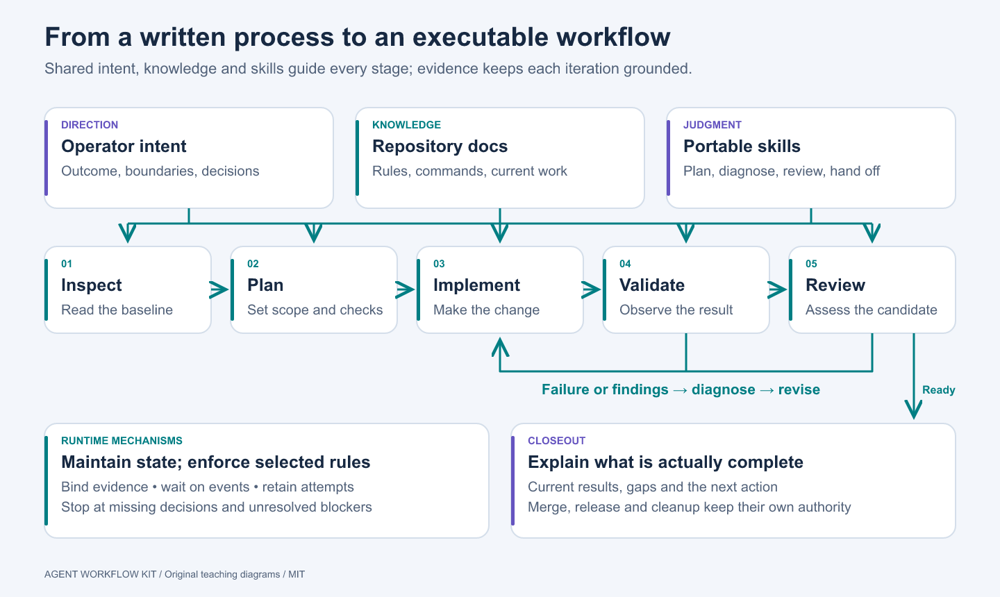
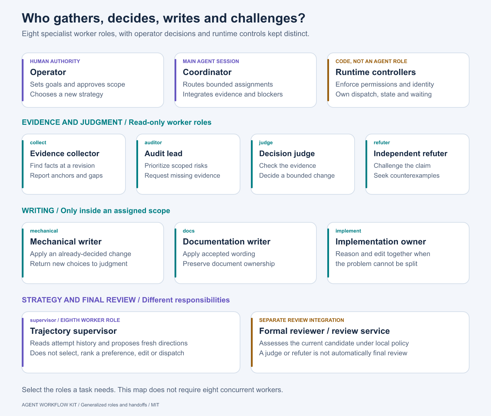

# Agent Workflow Kit

**Understand the workflow. Adapt your docs. Build your own Pi extension.**

A practical blueprint for turning an engineering process into an agent workflow: repository knowledge, reusable skills, verifiable work, and deterministic orchestration.

## Where to start

| You want to… | Start here |
| --- | --- |
| Understand how the pieces fit | [Workflow handbook](docs/WORKFLOW.md) |
| Understand the agent roles and handoffs | [Role and routing guide](docs/AGENT_ROLES.md) |
| Have an agent adapt your repository | [Adoption guide and prompt](docs/ADOPTION.md) |
| Identify the runtime components to build | [Runtime component blueprint](docs/RUNTIME_COMPONENTS.md) |
| Build your own Pi workflow extension | [Architecture and build path](docs/EXTENSION_FRAMEWORK.md) |
| Try a small working example | [Pi teaching extension](examples/pi-workflow/README.md) |
| Use one portable skill | [Skill catalog](skills/README.md) |
| Explore diagrams and research influences | [Visual guide](docs/VISUALS.md) · [Sources](docs/SOURCES.md) |

The full workflow is explained, but adoption is proportional. A small change may need an issue, a test and a review. A long-running multi-repository change may need explicit dependencies, durable evidence and a controller that remembers what is current.

## Who does the work?

The coordinator routes work among eight specialist roles: **collector, auditor, judge, refuter, mechanical writer, documentation writer, implementation owner, and trajectory supervisor**. The role guide explains when each is used, what it may change, and how decisions move to implementation.

**Roles also let you configure model and reasoning effort independently for efficiency.** Collection and already-decided edits can use a faster, lower-cost profile; judgment, refutation and difficult implementation can use a more capable model or higher effort. This is one reason to separate deciding a change from applying it. [See role profiles and an illustrative configuration](docs/AGENT_ROLES.md#configure-model-and-reasoning-effort-per-role).

The important handoff is often **evidence → judgment → decided application**, followed by validation and formal review. Difficult inseparable work uses the implementation-owner route. Repeated failure goes to a trajectory supervisor, which proposes directions for the operator to choose. [Read the role and routing guide](docs/AGENT_ROLES.md).

Build guidance includes a [component-by-component blueprint](docs/RUNTIME_COMPONENTS.md): goal controller, plan manager, progress tracker, subworker runner and worker-side extension, scheduling, validation/review, persistence and continuation. It distinguishes the demo’s implemented subset from the remaining runtime work.

## Included

Nine standalone skills, adaptable templates, fictional examples, a rule-to-mechanism framework, original technical diagrams, and a runnable TypeScript Pi extension. The extension demonstrates an operator decision, deterministic collector/judge/mechanical handoffs, a session candidate, a fixed validation check and evidence freshness. It does not supervise production workers, enforce a filesystem sandbox, automate code review or merge changes.

## Origins and reuse

Created by Zach Skjaveland, informed by his Limitless engineering workflow. This is newly authored guidance, not an export of the private runtime or its exact skills. The modular architecture taught here is a design pattern for readers, not a claim that the private runtime is already host-independent. A substantial Pi extension can have deep lifecycle, persistence, worker and UI coupling even when some policy logic is modular.

Research influences, including NVIDIA AVO, are credited in [Sources](docs/SOURCES.md). No affiliation, endorsement or benchmark equivalence is implied.

Original code, documentation and artwork use the [MIT license](LICENSE). This first version is prepared for private review before public sharing.
