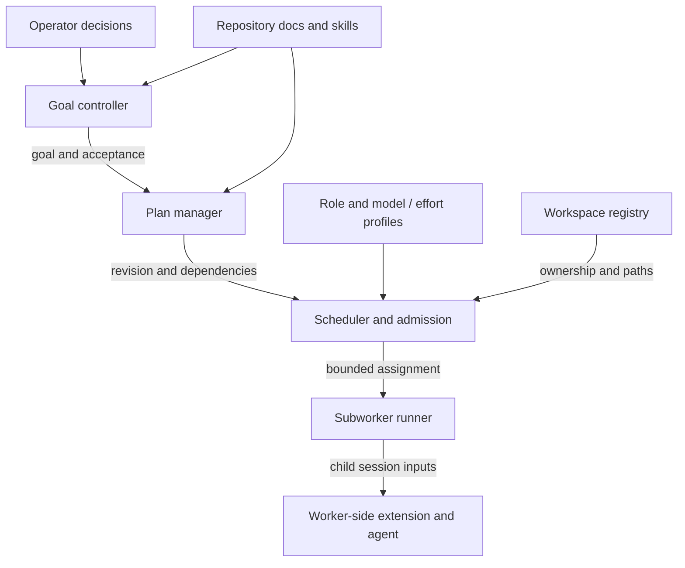
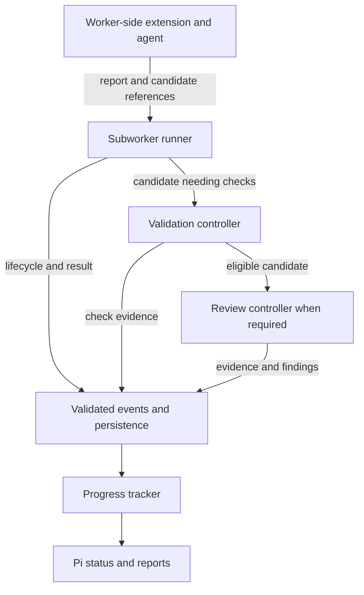
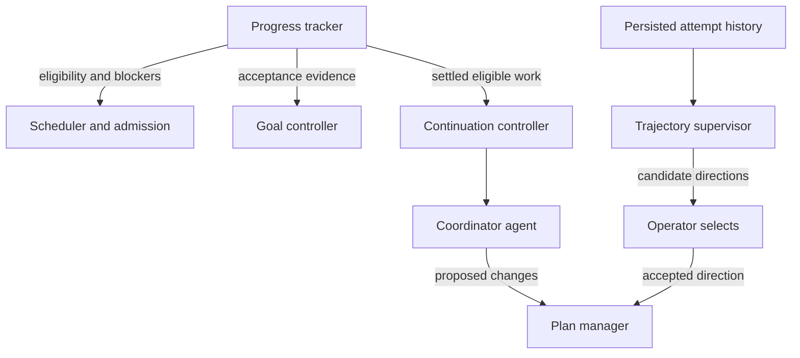

# Runtime component blueprint

A full workflow extension needs an explicit goal, a revisable plan, evidence-backed progress, and a controlled way to run workers. The role system defines who does each kind of work; these components make that work executable and recoverable.

This is a generic design to adapt, not a description of a private implementation or a claim that the teaching demo provides a production runtime. Components below are logical responsibilities. They can begin as modules in one Pi extension; each box does not require a separately installed extension.

## Component inventory

| Component | Owns and consumes | Produces or controls | Teaching demo today |
| --- | --- | --- | --- |
| **Guidance resolver** | Repository instructions, command owners, accepted issue/scope and current source identity | Resolved requirements and evidence references; ambiguity blocks affected actions | Only fixed fixture/root/commit/digest inspection; no general guidance resolution |
| **Goal controller** | Desired outcome, acceptance, exclusions, authorization references and stop conditions | Active goal and a completion decision supported by required evidence | Objective text and fixed fixture completion rule; no independent goal record or general acceptance evaluator |
| **Plan manager** | Goal reference, versioned steps, dependencies, role needs and acceptance per step | Current plan revision; changed steps invalidate affected assignments and decisions | One identified plan and a fixed three-role sequence; no editable dependency graph |
| **Progress tracker** | Admitted lifecycle events, validated results and blockers | Current step/attempt state, evidence references, blocker/clearing action and eligible next step | Phase, current handoff, check result and next-action status; no multi-step ledger |
| **Role/profile registry** | Responsibility, output contract, permissions, allowed children, model and reasoning effort | Validated effective worker profile attached to the assignment | Three fixed deterministic roles and targets; no model/effort selection |
| **Scheduler and admission controller** | Current plan, dependencies, authorization, capacity, workspace ownership and effective profile | Bounded assignments; admission/refusal; concurrency and resource ownership | Synchronous next-role admission only; no queue or concurrent dispatch |
| **Subworker runner** | Admitted assignment and immutable input references | Worker process/session lifecycle, bounded result transport, cancellation and terminal observations | Calls deterministic functions in process; no child Pi sessions or worker processes |
| **Worker-side extension** | One assignment, role/profile, tool restrictions and report contract | Worker-facing instructions/tools, permitted evidence requests and structured reports | Not implemented; deterministic functions receive narrow inputs instead |
| **Workspace registry** | Repository/worktree identity, allowed paths and exclusive writer ownership | Workspace leases and explicit release/cleanup eligibility | Source fixture is read-only; candidate lives in the session; no worktree management |
| **Validation controller** | Current candidate, canonical command declarations and required checkpoints | Observed execution results bound to candidate, command and attempt | One fixed check of the session candidate; no general command execution |
| **Review controller** | Review policy, candidate identity, request and findings | Serialized review state and finding dispositions; stale results cannot close work | Not implemented; a passing fixture check is not formal review |
| **Event store and recovery controller** | Versioned transitions, operation identities and host branch/session events | Durable history, restored state, stale-event rejection and reconciliation of unfinished work | Pi custom entries, selected-branch replay and refusal on malformed history/append failure; no process recovery |
| **Continuation controller** | Settled completion events, current progress, pending operator decisions and retry limits | At most one eligible coordinator wake; explicit waiting or stopped state | No automatic continuation; operator commands advance the route |
| **Trajectory review** | Retained attempts, failures, validation and review history | Supervisor proposals for an operator-selected new direction | Not implemented |
| **Pi tools, commands and UI** | Current state and explicit operator/model actions | Proposal tools, operator decisions, concise status and detailed inspection | Proposal tool; confirm/role/check/close/reset commands; status, roles and report views |

The **coordinator agent** uses these components to reason about the task and propose assignments or changes. It is not the scheduler code. The **operator** owns material scope and strategy decisions. Neither a progress label nor a worker report can grant new authority.

## How the components connect

Planning and dispatch:



Results return through validation and recorded progress:



Progress and history inform the next action:



The repeated component names refer to the same owners across these three views. Arrows carry inputs, requests or evidence, not blanket permission to execute. The event boundary validates each producer's records before persistence and projection; goal, plan and admission transitions also belong in that history. Validation and review are selected according to the plan's required checkpoints. Progress feeds admission for the next step and goal acceptance for completion; it does not automatically mark either successful.

Knowledge informs goal definition, baseline inspection, planning and later judgments. It is not merely an input to the final report. Recovery reloads history and then reconciles it with current source and live operations before scheduling resumes.

## Goal, plan and progress are different records

| Record | Example | Change rule |
| --- | --- | --- |
| Goal | “Correct the parser while preserving supported inputs; acceptance requires the specified regression checks and review.” | A material acceptance/scope change needs the applicable operator decision. |
| Plan | “Collect callers → judge the defect → apply the decided change → validate → review.” | Assign a new revision when steps, dependencies or accepted decisions change. Reconcile affected work before redispatch. |
| Progress | “Collection complete with evidence E; judgment running as attempt A; writing waits for that disposition.” | Derive from observed events and accepted results. An agent saying “done” is insufficient. |

Keep a stable goal ID, plan ID/revision and step ID. Each execution gets a distinct assignment and attempt identity, with source binding and effective role/profile. Progress should distinguish queued, admitted, running, settling, passed, failed, cancelled and blocked where those states exist. Process exit, accepted output and passed acceptance are separate observations.

Do not store an independently editable “percent complete” as authority. If displayed, derive it from an explicit rule and show blocked or invalidated work. Plan revision should supersede affected progress while preserving its history. A resumed session must not mistake an old step result for current acceptance.

## Parent runner versus worker-side extension

The **parent runner** launches and observes workers. It owns process/session identity, streams, timeout, cancellation, terminal observation and transport. The scheduler decides whether a launch is eligible; the runner executes that admitted request and reports what happened.

The **worker-side extension** runs inside the child host when needed. It receives a bounded assignment, installs the permitted role context and tools, and returns a structured report. It does not load a second parent coordinator, start the full goal loop, choose its own model/effort or grant itself new permissions. A role permitted to request collectors sends a bounded request back to parent admission; it does not freely spawn descendants.

A possible layout is:

```text
extensions/
  coordinator.ts       # Parent Pi entry: operator tools, lifecycle and UI
  worker.ts            # Child Pi entry: assignment and role-specific surface
runtime/
  goal.ts              # Acceptance and stop conditions
  plan.ts              # Revisions, steps and dependencies
  progress.ts          # Projection from accepted events
  profiles.ts          # Models, effort, tools and child-role policy
  admission.ts         # Eligibility, ownership and scheduling
  runner.ts            # Child host/process lifecycle and transport
  workspaces.ts        # Writer ownership and workspace identity
  validation.ts        # Actual command observations
  review.ts            # Request identity and finding disposition
  events.ts            # Schemas, persistence and replay
  recovery.ts          # Reconcile source and unfinished operations
  continuation.ts      # Settled-event wake and deduplication
```

These are suggested filenames, not files shipped by the demo or required Pi APIs. Parent and worker entry points may share modules in one package. A separate worker extension is useful when the child needs a custom restricted tool/report surface; a host's existing worker facility may supply that surface instead. Choose one owner for dispatch and continuation. Loading competing orchestration extensions into a session does not compose their state safely by itself.

The parent must enforce permissions through the execution paths it controls and appropriate host/process isolation. Worker prompts and tool declarations alone do not contain arbitrary code. Resolve supported model and effort settings before launch, record the effective profile, and keep responsibility boundaries intact when tuning efficiency. See [role configuration](AGENT_ROLES.md#configure-model-and-reasoning-effort-per-role).

## One task through the architecture

1. Resolve the current instructions and baseline. Record the accepted goal, exclusions and required evidence.
2. Create a plan revision with bounded steps and dependencies. Admission checks scope, source, profile and ownership before creating an assignment.
3. Launch a collector using its configured model/effort. The worker returns anchors and gaps; the parent validates identity and output before progress advances.
4. Admit the judge using the current evidence. A ready disposition enables the mechanical assignment; an unresolved decision records a blocker. The writer gets the frozen decision and exclusive workspace ownership.
5. Observe writer settlement and inspect the candidate. Run the required validation, then formal review where required. Findings return to judgment and plan/progress reconciliation.
6. Evaluate goal acceptance against current evidence. If all required conditions hold, close the goal. If execution is stalled, retain the attempts for trajectory review and let the operator choose a new direction.

For inseparable implementation, select the implementation-owner route explicitly instead of forcing a judge/writer split. The other components still bind scope, execution and acceptance.

## Build order and failure checkpoints

| Slice | Add together | Must demonstrate before expanding |
| --- | --- | --- |
| 1. One durable route | Goal/plan subset, events, progress and operator UI | Restore current state; reject stale inputs, missing decisions and malformed history. The teaching demo covers a narrow version. |
| 2. One real worker | Role/profile resolution, admission, runner and child surface | Effective model/effort and permissions match the assignment; wrong-role and wrong-attempt reports refuse; cancellation and launch failure cannot become success. |
| 3. One source-writing route | Workspace registry, writer admission and actual validation | One writer owns the workspace; decided edits stay bounded; source changes invalidate old evidence; uncertain work is preserved. |
| 4. Dependencies and concurrency | Revisable plan, progress ledger and scheduler | A blocked prerequisite prevents dispatch; revisions invalidate affected work; no conflicting ownership. |
| 5. Review and recovery | Review controller and unfinished-operation reconciliation | One current review per target; stale findings/results refuse; restart neither duplicates live work nor assumes it completed. |
| 6. Continuation and strategy | Settled-event wake, attempt history and trajectory review | No duplicate wake; missing decisions remain blocked; supervisor proposals cannot select their own strategy. |

[Build milestones](BUILD_MILESTONES.md) expands the later operational checkpoints. [Contracts](CONTRACTS.md) describes binding and replay rules. Keep the first implementation proportional: a single sequential workflow can use one module for several responsibilities, provided the ownership and failure behavior remain clear.

## Hand this blueprint to an implementing agent

```text
Map my adopted repository workflow to the runtime component inventory. For each selected
component, identify its existing owner or proposed module, inputs, records, outputs,
enforcement boundary, recovery behavior and acceptance test. Distinguish parent orchestration
from the worker-side host surface. Define goal, plan revision, progress and assignment identity.
Configure model and reasoning effort per role without changing permissions. Mark implemented,
partial and missing capabilities from actual source. Select one end-to-end build slice and
state dependencies, validation, rollback and operator decisions needed. Do not assume that
all components need separate extensions or that the teaching demo already implements them.
```
