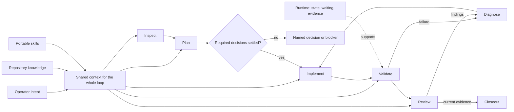
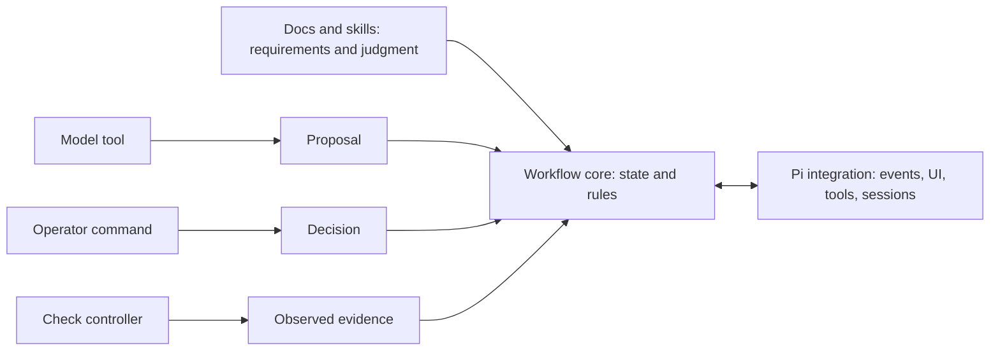
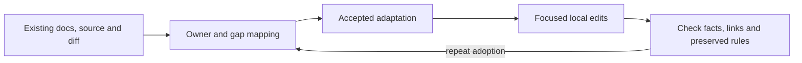
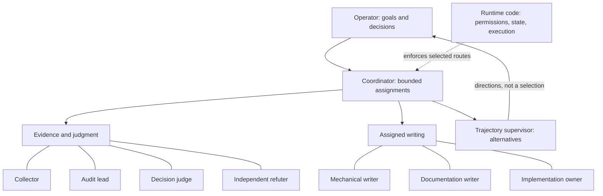
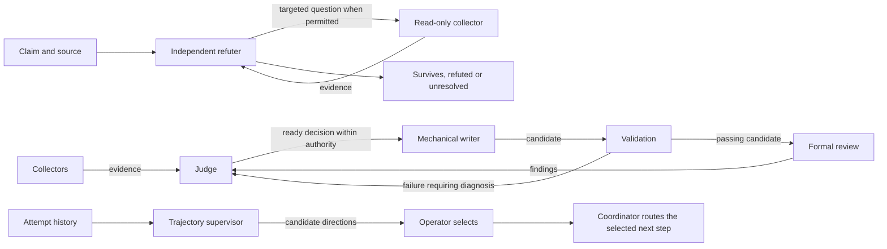
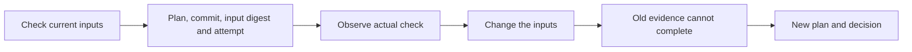

# Visual guide

These original diagrams explain the proposed workflow and extension design. SVG files are editable sources; PNGs are generated exports. Each diagram also has a simplified Mermaid version below. No external artwork is embedded.

## Workflow and feedback

[SVG](../assets/diagrams/workflow-overview.svg) · [PNG](../assets/diagrams/workflow-overview.png)

Intent and repository knowledge guide the work. Validation and review feed diagnosis. Completion is evidence-based, and consequential outward actions retain their own authority.

## Extension responsibilities

[SVG](../assets/diagrams/extension-layers.svg) · [PNG](../assets/diagrams/extension-layers.png)

The layers are responsibilities to design and test. Existing Pi runtimes can have substantial host coupling. A modular source tree alone does not prove that replacing the adapter is possible.

## Documentation adaptation

[SVG](../assets/diagrams/documentation-adaptation.svg) · [PNG](../assets/diagrams/documentation-adaptation.png)

Map roles onto current owners. Preserve stronger requirements and history. A repeated adoption should reconcile those same owners rather than generate a second system.

## Role map

[SVG](../assets/diagrams/agent-roles.svg) · [PNG](../assets/diagrams/agent-roles.png) · [Role guide](AGENT_ROLES.md)

This is a responsibility map, not an instruction to run every role. The operator decides, the coordinator routes, and runtime code enforces the selected workflow. The eight worker roles have different inputs, permissions and outputs.

## Role handoffs

[SVG](../assets/diagrams/coordination.svg) · [PNG](../assets/diagrams/coordination.png)

The main row shows a selected decision/application route. Its arrows carry reports, decisions, candidates and results; actual dispatch remains runtime-mediated under coordinator/operator authority. The other rows show conditional alternatives, not automatic extra stages.

## Rule to mechanism

[SVG](../assets/diagrams/rule-to-mechanism.svg) · [PNG](../assets/diagrams/rule-to-mechanism.png)

Choose one deterministic rule, implement its enforcement point, then test a violating case. Keep unimplemented production mechanisms clearly separate from the teaching example.

## Runtime component connections

The [component blueprint](RUNTIME_COMPONENTS.md#how-the-components-connect) includes an editable Mermaid diagram connecting goal, plan, admission, workers, validation/review, progress, persistence and continuation. Its inventory identifies what the executable demo covers and what remains to build.
