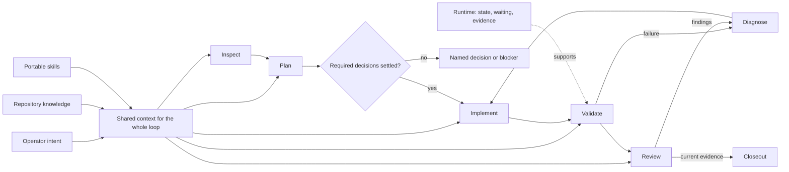
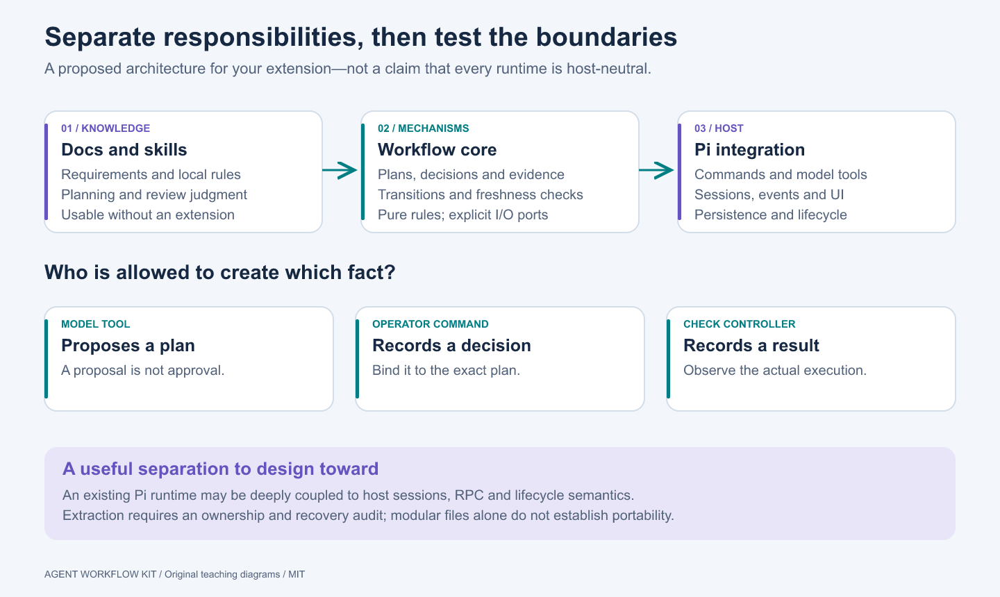
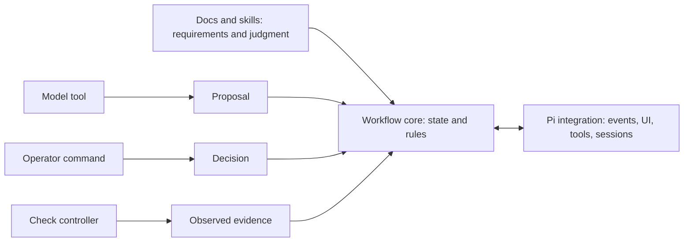
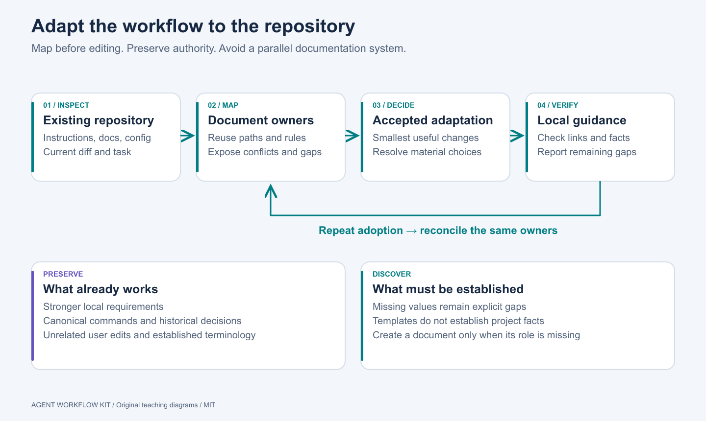
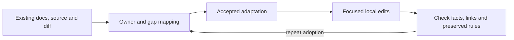
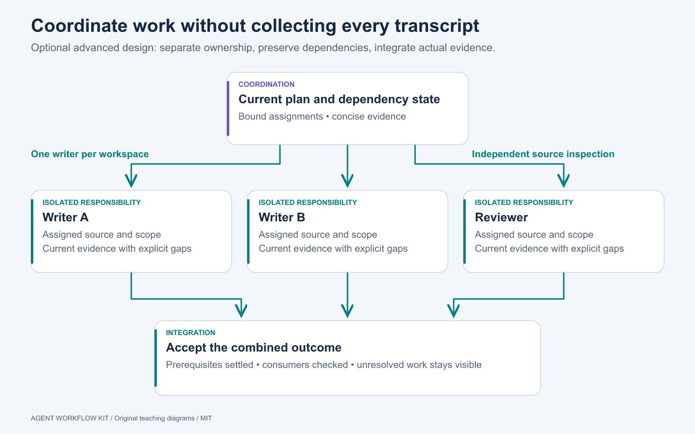
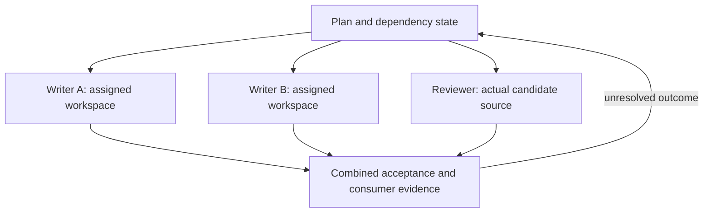
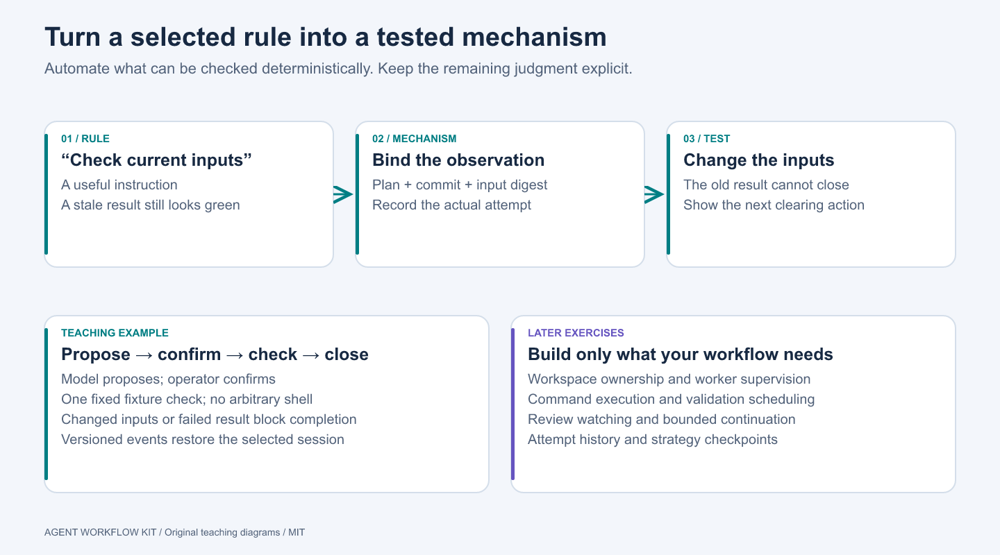
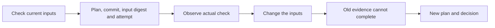

# Visual guide

These original diagrams explain the proposed workflow and extension design. SVG files are editable sources; PNGs are generated exports. Each diagram also has a simplified Mermaid version below. No external artwork is embedded.

## Workflow and feedback

[SVG](../assets/diagrams/workflow-overview.svg) · [PNG](../assets/diagrams/workflow-overview.png)

Intent and repository knowledge guide the work. Validation and review feed diagnosis. Completion is evidence-based, and consequential outward actions retain their own authority.

## Extension responsibilities

[SVG](../assets/diagrams/extension-layers.svg) · [PNG](../assets/diagrams/extension-layers.png)

The layers are responsibilities to design and test. Existing Pi runtimes can have substantial host coupling. A modular source tree alone does not prove that replacing the adapter is possible.

## Documentation adaptation

[SVG](../assets/diagrams/documentation-adaptation.svg) · [PNG](../assets/diagrams/documentation-adaptation.png)

Map roles onto current owners. Preserve stronger requirements and history. A repeated adoption should reconcile those same owners rather than generate a second system.

## Optional coordination

[SVG](../assets/diagrams/coordination.svg) · [PNG](../assets/diagrams/coordination.png)

Workers receive bounded assignments. Reviewers inspect actual source. Integration checks the combined outcome and dependent consumers; it is not simply a collection of green worker reports.

## Rule to mechanism

[SVG](../assets/diagrams/rule-to-mechanism.svg) · [PNG](../assets/diagrams/rule-to-mechanism.png)

Choose one deterministic rule, implement its enforcement point, then test a violating case. Keep unimplemented production mechanisms clearly separate from the teaching example.

